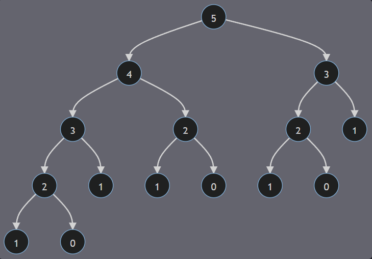

# DP(Dynamic Programming)
This chapter is my summary of all efforts and earns in learning *Dynamic Programming*. I arrange all chapters based on **my own** thoughts and method of cognition. Last sentence meant to point that this whole note was **extremely private**, which also means it may be lack of *systematic* and *professional*.
\* b.t.w I'm not a English-Speaker with strong willing to exercise the ability of Writing in English. That's why this whole note written by English and unavoidable to maintain some Chinese express and nicknames.

##  Basic Idea

### Recurrence Relation/State Transfer Equation

The core idea of DP is writing correct **Recurrence Relation**(**State Transfer Equation**) to split a enormous problem with plenty of repeated computation into many less(or said easier) pieces(i.e. which I called *children problem*). Then we can solve the initial problem via combining all the children problems.

### Instance—Fibonacci Sequence

I have first met the *Fibonacci Sequence* when I'm a silly high school student while I'm playing mud and learning **recursion algorithm** at the same time. *Fibonacci Sequence* can be described through the **0-indexed** equation below(The index *i* in $f_{i}$ refers to the position of the element):
	$$
\begin{cases}
    f_{0}=0 \\
    f_{1}=1 \\
    f_{n}=f_{n-1}+f_{n-2}, n\geq2
\end{cases}
$$
We can easily solve this problem through using **recursion algorithm**:
```cpp
int feib(int n){
	// Boundary to end up the children-problem
	if (n==0 || n==1){
		return n;
	}
	return feib(n-1)+feib(n-2);
}
```

But actually there were plenty of repeated computation in the algorithm above. And the less index of children problem is, the more repeated computation it caused.

e.g. We need compute $f(4)$ and $f(3)$ to get $f(5)$, while we need once more computation of $f(3)$ to get $f(4)$ ...

It can be proved that as the *n* large enough, there will cost super-sized waste of time. More professionally, the *Time Complexity* and the *Space Complexity* of "Violent Solution by Recursion"(i.e. A joked name for silly solution in Chinese) was $\Theta((\frac{1+\sqrt{5}}{2})^n)$ and $\Theta(1)$. More analysis can be found in [递归暴力求解斐波那契数列的时间复杂度](https://zhuanlan.zhihu.com/p/257214075)

To cut down the waste of time in this situation, the "easiest" method in DP has been given a birth with the name called **Recursion with a Memory Array**.

This means we will push every element which was **first** to be computed into an array. So that we can get the value from the array directly when we need *compute* it later. It was always coded through **Hash List**. Which means we can generate a hash list *F* to store each value of $f(n)$:
```cpp
map<int, int> F;

int feib(int n){
	// Boundary to end up the children-problem
	if (n==0 || n==1){
		F[n] = n;
		return n;
	}
	
	// First be computed
	if (!F.count(n)){
		F[n] = feib(n-1)+feib(n-2);
	}
	
	return F[n];
}
```

Let's re-discuss the *Time Complexity* and the *Space Complexity* after the optimization above. As for the time complexity, every $f(n)$ need and only need **one** computation here, while we are solving children problems through a method similar to **traversing a binary tree**. The image below may help us figure it out more clearly. 

As we talked above, it can be proved that the time complexity here was $\Theta(n^2)$. It has improved a lot from exponential cost in time caused by simple recursion. However, *boost always need cost*, the space complexity here has been increased to $\Theta(n)$ from original $\Theta(1)$ without any extra cost in space. It also told as **Trades-off between time and space**(i.e. comes from “空间换时间” in Chinese).

This instance tells us that DP focus on solving a problem by **splitting it to many children problems**, then deal with them and combine them all up in a **Limited Linear Time**. More mathematically, the problem we face to can be describe as a kind of *"state"*, and what we need is the value of current state. What we need to do is combing previous states through correct **Recurrence Relation/State Transfer Equation**. 

Based on all we talked above, DP can be easily regarded as **Recursion Algorithm with Linearly Optimization**.

### Space Optimization—Scrolling Array

Still talking about the instance above(*i.e. Fibonacci without any doubt*). It's not difficult to find that our computation **was and only was related to three variables** through the *General Equation* when $n\geq2$, which were $f(n)$, $f(n-1)$ , $f(n-2)$. These three guys will **scroll left** after each single computation due to their orderly, which means current $f(n-1)$ was the $f(n)$ in computation at last time. Similarly, current $f(n-2)$ was the $f(n-1)$ in computation at last time.

It can be viewed as all Elements in an array keep **scrolling left**. It can be obviously described by the equation below. (Suppose that the superscript *i* refers to the times of operation and the subscript $0、1、2$ refer to the index of the element.)
$$
\begin{cases}
    f_{0}^{i+1}=f_{1}^{i} \\
    f_{1}^{i+1}=f_{2}^{i} \\
    f_{2}^{i+1}=F(f_{0}^{i}, f_{1}^{i})
\end{cases}
$$
\*Addition: The function F here refers to the **State Transfer Equation**

Here's a template codes for this idea:
```cpp
int p = 0;
int q = f[0];
int r = f[1];

for (int i = 2; i <= n; i++){
	p = q;
	q = r;
	r = F(p, q);
}
```

Then we can get $f_{n}$ from r when *n* more than 2. The obstacle of this method may focus on how to **confirm the initial value** and need talk about the boundary specially.

Applying this method to DP problems can always cut down a plenty of waste in space. More specifically, **Space Complexity** here is $\Theta(1)$.

Review the argument about the *Fibonacci Sequence*, we can optimize the codes by using "Scrolling Array":
```cpp
int p = 0;
int q = 0;
int r = 1;

int feib(int n){
	if (n==0||n==1){
		return n;
	}
	
	// Start Scrolling!
	for(int i = 2; i <= n; i++){
		p = q;
		q = r;
		r = p+q;
	}
	return r;
}
```

We can also figure out that this method make the **Time Complexity** turning to $\Theta(n)$.

### Some Classical Problems(Easy)

1\) **Climbing to the DP paradise**([LeetCode-70](https://leetcode.cn/problems/climbing-stairs/?envType=study-plan&id=dong-tai-gui-hua-ru-men&plan=dynamic-programming&plan_progress=xh7ysyvj))

**Problem Description: 
You are climbing a staircase to DP paradise. It takes *n* steps to reach the paradise. Each time you can either climb 1 or 2 steps. In how many distinct ways can you climb to the top?**

**Solving Ideas**
First let's try to confirm which value we care about. Obviously the only value here we care about is the number of climbing ways. Suppose that $f(n)$ specifies the number of climbing ways to reach the place indexed by *n*.

Then the answer(or said as *current state*) was clearly $f(n)$. Meanwhile each step has only two possible value — 1 or 2. **It implies we can reach *n* as we can reach *n-1* or *n-2*.**

So we get a recurrence relation here:
$f(n)=f(n-1)+f(n-2)$
\* Here it can be told as just a *clothed* Fibonacci Sequence.

**Solving Codes(Optimized with Scrolling Array)**
```cpp
int climbStairs(int n) {
 // Scrolling Array
 int p = 0;
 int q = 0;
 int r = 1;

 for ( int i = 1; i <= n; i++ ){
            p = q;
            q = r;
            r = p+q;
        }  

 return r;
}
```

2\) **House Robber Ⅰ**([LeetCode-198](https://leetcode.cn/problems/house-robber/?envType=study-plan&id=dong-tai-gui-hua-ru-men&plan=dynamic-programming&plan_progress=xh7ysyvj))
\* It's a really classical series of problems that lead me to the world of DP!!! "打家劫舍" must own its original Chinese name!!!

**Problem Description:
You are a professional robber planning to rob houses along a street. Each house has a certain amount of money stashed, the only constraint stopping you from robbing each of them is that adjacent houses have security systems connected and *it will automatically contact the police if two adjacent houses were broken into on the same night*.**

**Given an integer array *nums* representing the amount of money of each house, return the maximum amount of money you can rob tonight *without alerting the police*.**

**Solving Ideas**

## Kadane's Algorithm
Jay Kadane in CMU first found out this algorithm in 1984. It's a classical algorithm based on DP thoughts with a long history.

### Prompt-Born Problem
